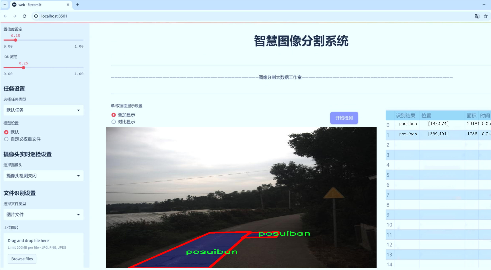
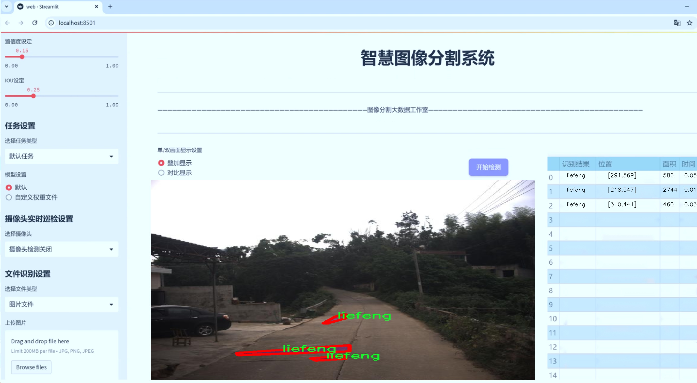
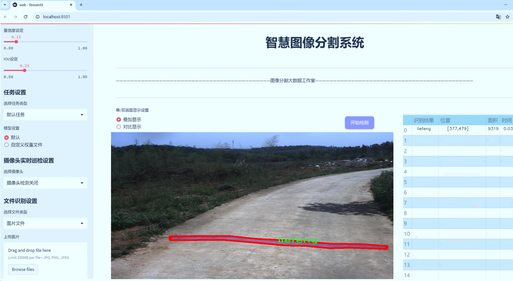
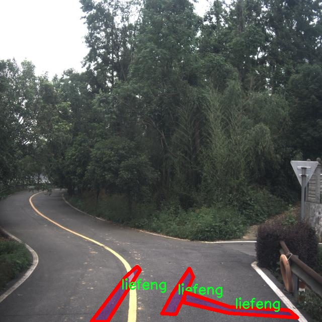
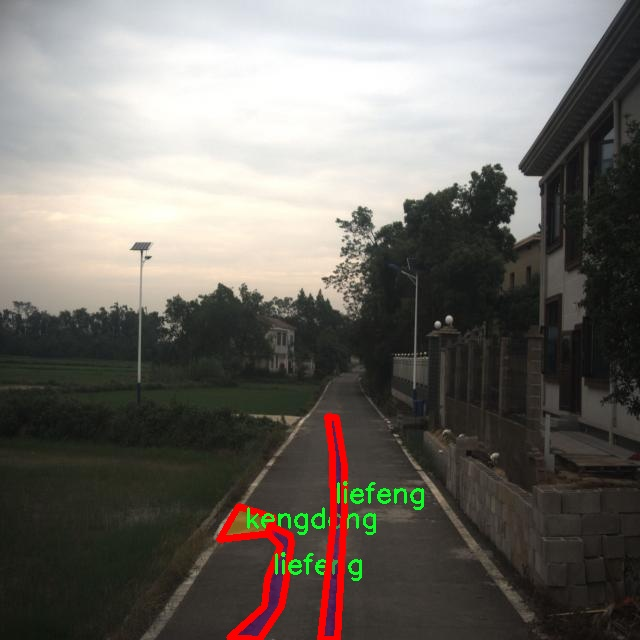
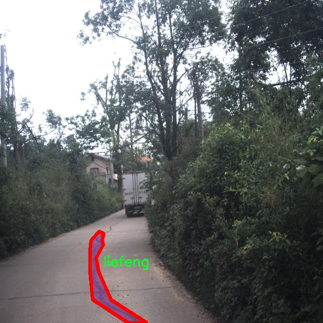
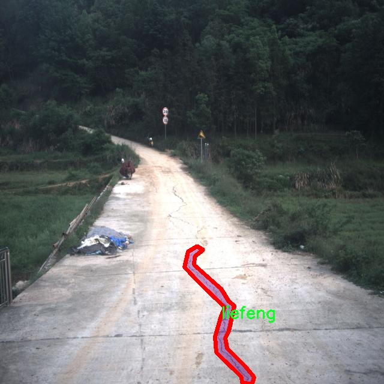
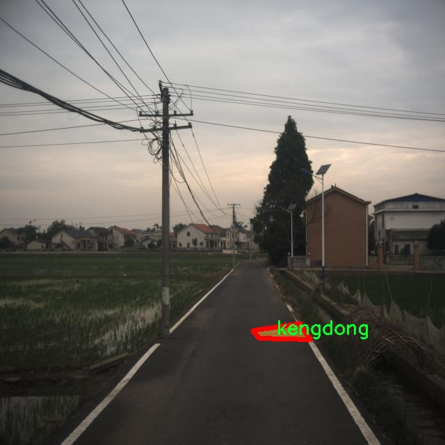

# 道路损坏分割系统源码＆数据集分享
 [yolov8-seg-goldyolo＆yolov8-seg-convnextv2等50+全套改进创新点发刊_一键训练教程_Web前端展示]

### 1.研究背景与意义

项目参考[ILSVRC ImageNet Large Scale Visual Recognition Challenge](https://gitee.com/YOLOv8_YOLOv11_Segmentation_Studio/projects)

项目来源[AAAI Global Al lnnovation Contest](https://kdocs.cn/l/cszuIiCKVNis)

研究背景与意义

随着城市化进程的加快，交通基础设施的建设与维护变得愈发重要。道路作为城市交通的主要枢纽，其状况直接影响到交通安全和行车效率。然而，随着时间的推移和车辆负荷的增加，道路损坏问题日益严重，导致交通事故频发和经济损失。因此，及时、准确地识别和评估道路损坏情况，对于城市管理者和交通部门而言，具有重要的现实意义。

传统的道路损坏检测方法主要依赖人工巡查和经验判断，这不仅效率低下，而且容易受到主观因素的影响，导致漏检和误判。近年来，随着计算机视觉和深度学习技术的快速发展，基于图像处理的自动化道路损坏检测方法逐渐兴起。尤其是实例分割技术的应用，使得对道路损坏的识别更加精确和细致。YOLO（You Only Look Once）系列模型因其实时性和高效性，成为了目标检测领域的热门选择。YOLOv8作为该系列的最新版本，具备了更强的特征提取能力和更高的检测精度，为道路损坏的自动化检测提供了新的可能性。

本研究旨在基于改进的YOLOv8模型，构建一个高效的道路损坏分割系统。该系统将针对四类道路损坏情况进行识别与分割，分别为坑洞（kengdong）、裂缝（liefeng）、破损板（posuiban）和微裂缝（wzliefeng）。通过对2000幅标注图像的训练，系统能够在复杂的道路环境中，快速而准确地识别不同类型的损坏，进而为道路维护提供科学依据。

在数据集方面，本研究所使用的2000幅图像涵盖了多种不同的道路损坏场景，具备较高的代表性和多样性。这为模型的训练提供了丰富的样本，能够有效提升模型的泛化能力和鲁棒性。此外，实例分割技术的引入，使得系统不仅能够识别损坏的存在，还能够精确地划分损坏区域，为后续的损坏评估和修复方案制定提供了重要的数据支持。

通过本研究的开展，期望能够实现以下几个目标：一是提升道路损坏检测的自动化水平，减少人工巡查的工作量；二是提高道路损坏识别的准确性，降低漏检和误判的风险；三是为城市交通管理提供数据支持，助力智慧交通的建设。最终，本研究不仅具有重要的学术价值，也为实际应用提供了切实可行的解决方案，对提升城市交通基础设施的管理水平具有积极的推动作用。

### 2.图片演示







##### 注意：由于此博客编辑较早，上面“2.图片演示”和“3.视频演示”展示的系统图片或者视频可能为老版本，新版本在老版本的基础上升级如下：（实际效果以升级的新版本为准）

  （1）适配了YOLOV8的“目标检测”模型和“实例分割”模型，通过加载相应的权重（.pt）文件即可自适应加载模型。

  （2）支持“图片识别”、“视频识别”、“摄像头实时识别”三种识别模式。

  （3）支持“图片识别”、“视频识别”、“摄像头实时识别”三种识别结果保存导出，解决手动导出（容易卡顿出现爆内存）存在的问题，识别完自动保存结果并导出到tempDir中。

  （4）支持Web前端系统中的标题、背景图等自定义修改，后面提供修改教程。

  另外本项目提供训练的数据集和训练教程,暂不提供权重文件（best.pt）,需要您按照教程进行训练后实现图片演示和Web前端界面演示的效果。

### 3.视频演示

[3.1 视频演示](https://www.bilibili.com/video/BV1U81hYXEK2/)

### 4.数据集信息展示

##### 4.1 本项目数据集详细数据（类别数＆类别名）

nc: 4
names: ['kengdong', 'liefeng', 'posuiban', 'wzliefeng']


##### 4.2 本项目数据集信息介绍

数据集信息展示

在现代计算机视觉领域，尤其是在道路损坏检测与分割的任务中，数据集的质量和多样性直接影响到模型的性能和泛化能力。本研究所使用的数据集名为“1111”，其设计旨在为改进YOLOv8-seg的道路损坏分割系统提供强有力的支持。该数据集包含四个主要类别，分别是“kengdong”（坑洞）、“liefeng”（裂缝）、“posuiban”（破碎板）和“wzliefeng”（纹理裂缝），这些类别涵盖了道路损坏的常见类型，能够有效地帮助模型学习和识别不同的损坏特征。

“1111”数据集的构建过程经过精心设计，确保了数据的多样性和代表性。每个类别的样本均来源于不同的道路环境和气候条件，涵盖了城市道路、乡村道路以及高速公路等多种场景。这种多样性不仅提高了模型对不同类型道路损坏的识别能力，也增强了其在实际应用中的适应性。数据集中每个类别的样本数量经过精心平衡，以避免模型在训练过程中出现偏向某一类别的现象，从而提高了模型的整体性能。

在数据标注方面，数据集“1111”采用了高精度的标注技术，确保每个样本的损坏区域都得到了准确的标识。标注人员经过专业培训，能够准确识别和标注不同类型的道路损坏，这为后续的模型训练提供了坚实的基础。每个样本不仅包含损坏区域的像素级标注信息，还附带了相关的元数据，如拍摄时间、地点、天气条件等，这些信息为后续的分析和模型优化提供了丰富的背景资料。

为了进一步增强数据集的实用性，研究团队还对数据进行了多种增强处理，包括旋转、缩放、裁剪和颜色变换等。这些增强手段不仅增加了数据集的样本数量，还提高了模型对不同视觉条件的鲁棒性，使其能够在各种复杂环境中保持良好的性能。此外，数据集还经过了严格的质量控制，确保每个样本的标注和图像质量达到高标准，从而为模型的训练提供可靠的数据支持。

在使用“1111”数据集进行YOLOv8-seg模型的训练时，研究团队将采用先进的训练策略，包括迁移学习和自适应学习率调整等。这些策略将有助于模型在有限的训练时间内达到最佳性能，同时减少过拟合的风险。通过对“1111”数据集的深入分析和利用，研究团队期望能够显著提升道路损坏分割系统的准确性和效率，为城市基础设施的维护和管理提供科学依据。

总之，数据集“1111”不仅在类别划分和样本标注上具有高质量的标准，其多样性和丰富的元数据也为模型的训练和优化提供了坚实的基础。通过充分利用这一数据集，研究团队希望能够推动道路损坏检测技术的发展，为智能交通系统的建设贡献力量。











### 5.全套项目环境部署视频教程（零基础手把手教学）

[5.1 环境部署教程链接（零基础手把手教学）](https://www.bilibili.com/video/BV1jG4Ve4E9t/?vd_source=bc9aec86d164b67a7004b996143742dc)


[5.2 安装Python虚拟环境创建和依赖库安装视频教程链接（零基础手把手教学）](https://www.bilibili.com/video/BV1nA4VeYEze/?vd_source=bc9aec86d164b67a7004b996143742dc)

### 6.手把手YOLOV8-seg训练视频教程（零基础小白有手就能学会）

[6.1 手把手YOLOV8-seg训练视频教程（零基础小白有手就能学会）](https://www.bilibili.com/video/BV1cA4VeYETe/?vd_source=bc9aec86d164b67a7004b996143742dc)


按照上面的训练视频教程链接加载项目提供的数据集，运行train.py即可开始训练



     Epoch   gpu_mem       box       obj       cls    labels  img_size
     1/200     0G   0.01576   0.01955  0.007536        22      1280: 100%|██████████| 849/849 [14:42<00:00,  1.04s/it]
               Class     Images     Labels          P          R     mAP@.5 mAP@.5:.95: 100%|██████████| 213/213 [01:14<00:00,  2.87it/s]
                 all       3395      17314      0.994      0.957      0.0957      0.0843

     Epoch   gpu_mem       box       obj       cls    labels  img_size
     2/200     0G   0.01578   0.01923  0.007006        22      1280: 100%|██████████| 849/849 [14:44<00:00,  1.04s/it]
               Class     Images     Labels          P          R     mAP@.5 mAP@.5:.95: 100%|██████████| 213/213 [01:12<00:00,  2.95it/s]
                 all       3395      17314      0.996      0.956      0.0957      0.0845

     Epoch   gpu_mem       box       obj       cls    labels  img_size
     3/200     0G   0.01561    0.0191  0.006895        27      1280: 100%|██████████| 849/849 [10:56<00:00,  1.29it/s]
               Class     Images     Labels          P          R     mAP@.5 mAP@.5:.95: 100%|███████   | 187/213 [00:52<00:00,  4.04it/s]
                 all       3395      17314      0.996      0.957      0.0957      0.0845


### 7.50+种全套YOLOV8-seg创新点代码加载调参视频教程（一键加载写好的改进模型的配置文件）

[7.1 50+种全套YOLOV8-seg创新点代码加载调参视频教程（一键加载写好的改进模型的配置文件）](https://www.bilibili.com/video/BV1Hw4VePEXv/?vd_source=bc9aec86d164b67a7004b996143742dc)

### 8.YOLOV8-seg图像分割算法原理

原始YOLOV8-seg算法原理

YOLOv8-seg算法是YOLO系列中的最新进展，旨在通过引入更为先进的技术来提升目标检测和分割的性能。相较于以往的YOLO版本，YOLOv8-seg在结构设计上进行了显著的优化，特别是在处理复杂背景和小目标检测方面。该算法采用了anchor-free的方法，摆脱了传统的anchor-based检测框架，进而实现了更高的检测精度和速度。这一转变不仅提高了模型的效率，还使得YOLOv8-seg在多种应用场景中表现出色，尤其是在动态和复杂的环境中。

YOLOv8-seg的核心结构由四个主要模块组成：输入端、主干网络、Neck端和输出端。输入端负责对输入图像进行预处理，包括Mosaic数据增强、自适应图像缩放和灰度填充等操作，以提高模型对不同输入条件的适应能力。主干网络则是特征提取的关键部分，采用了改进的C2f模块，结合了卷积和池化等操作，以获取更丰富的特征信息。这一模块的设计不仅增强了特征的表达能力，还有效地减轻了噪声对特征提取的影响。

在Neck端，YOLOv8-seg引入了路径聚合网络（PAN）结构，通过上采样和下采样的方式对不同尺度的特征图进行融合。这一过程确保了语义信息和定位信息的有效传递，使得模型在处理多尺度目标时能够保持较高的准确性。输出端则采用了解耦头结构，将分类和回归过程分开处理，从而加速了模型的收敛，并提高了检测的精度。

尽管YOLOv8-seg在设计上已经取得了显著的进步，但在实际应用中，尤其是在复杂水面环境下，仍然面临一些挑战。小目标漂浮物的特征复杂且背景多样，导致模型在定位和感知能力上存在不足。为了解决这些问题，YOLOv8-seg算法在原有基础上进行了进一步的改进，提出了YOLOv8-WSSOD算法。

YOLOv8-WSSOD算法通过引入BiFormer双层路由注意力机制构建C2fBF模块，旨在捕获远程依赖关系，从而保留特征提取过程中更细粒度的上下文信息。这一机制的引入，使得模型在处理复杂背景时能够更好地理解目标与背景之间的关系，从而提高了对小目标的感知能力。此外，为了应对小目标漏检的问题，YOLOv8-WSSOD在网络中添加了一个更小的检测头，进一步提升了对小目标的检测能力。

在Neck端，YOLOv8-WSSOD还引入了GSConv和Slim-neck技术，这些技术不仅保持了模型的检测精度，还有效降低了计算量，使得模型在实际应用中更加高效。这一系列的改进使得YOLOv8-WSSOD在处理复杂场景时，能够更准确地识别和定位目标，尤其是在水面等动态环境中。

最后，YOLOv8-WSSOD还对损失函数进行了优化，使用MPDIoU损失函数替代了传统的CIoU损失函数。这一改进不仅提高了模型的泛化能力，还增强了其在复杂环境下的精准度。通过对损失函数的优化，YOLOv8-WSSOD能够更好地适应不同的目标检测任务，尤其是在小目标检测和复杂背景下的表现。

综上所述，YOLOv8-seg算法在YOLO系列中标志着一个新的里程碑，通过引入多种先进的技术和优化策略，显著提升了目标检测和分割的性能。尽管在复杂环境中仍面临挑战，但通过YOLOv8-WSSOD的改进，模型在小目标检测和复杂背景处理方面的能力得到了有效增强。这些进展不仅为目标检测领域提供了新的思路，也为未来的研究和应用奠定了坚实的基础。


### 9.系统功能展示（检测对象为举例，实际内容以本项目数据集为准）

图9.1.系统支持检测结果表格显示

  图9.2.系统支持置信度和IOU阈值手动调节

  图9.3.系统支持自定义加载权重文件best.pt(需要你通过步骤5中训练获得)

  图9.4.系统支持摄像头实时识别

  图9.5.系统支持图片识别

  图9.6.系统支持视频识别

  图9.7.系统支持识别结果文件自动保存

  图9.8.系统支持Excel导出检测结果数据


### 10.50+种全套YOLOV8-seg创新点原理讲解（非科班也可以轻松写刊发刊，V11版本正在科研待更新）

#### 10.1 由于篇幅限制，每个创新点的具体原理讲解就不一一展开，具体见下列网址中的创新点对应子项目的技术原理博客网址【Blog】：


[10.1 50+种全套YOLOV8-seg创新点原理讲解链接](https://gitee.com/qunmasj/good)

#### 10.2 部分改进模块原理讲解(完整的改进原理见上图和技术博客链接)【如果此小节的图加载失败可以通过CSDN或者Github搜索该博客的标题访问原始博客，原始博客图片显示正常】
### YOLOv8简介
根据官方描述，Yolov8是一个SOTA模型，它建立在Yolo系列历史版本的基础上，并引入了新的功能和改进点，以进一步提升性能和灵活性，使其成为实现目标检测、图像分割、姿态估计等任务的最佳选择。其具体创新点包括一个新的骨干网络、一个新的Ancher-Free检测头和一个新的损失函数，可在CPU到GPU的多种硬件平台上运行。
此外，Yolov8还有一个特点就是可扩展性，ultralytics没有直接将开源库命名为Yolov8，而是直接使用"ultralytcs"，将其定位为算法框架，而非某一个特定算法。这也使得Yolov8开源库不仅仅能够用于Yolo系列模型，而且能够支持非Yolo模型以及分类分割姿态估计等各类任务。
总而言之，Yolov8是Yolo系列模型的最新王者，各种指标全面超越现有对象检测与实例分割模型，借鉴了Yolov5、Yolov6、YoloX等模型的设计优点，在全面提升改进Yolov5模型结构的基础上实现，同时保持了Yolov5工程化简洁易用的优势。

#### Yolov8创新点
Yolov8主要借鉴了Yolov5、Yolov6、YoloX等模型的设计优点，其本身创新点不多，偏重在工程实践上，具体创新如下:
·提供了一个全新的SOTA模型（包括P5 640和P6 1280分辨率的目标检测网络和基于YOLACT的实例分割模型)。并且，基于缩放系数提供了N/S/M/L/X不同尺度的模型，以满足不同部署平台和应用场景的需求。
. Backbone:同样借鉴了CSP模块思想，不过将Yolov5中的C3模块替换成了C2f模块
实现了进—步轻量化，同时沿用Yolov5中的
SPPF模块，并对不同尺度的模型进行精心微调，不再是无脑式一套参数用于所有模型，大幅提升了模型性能。
。Neck:继续使用PAN的思想，但是通过对比YOLOv5与YOLOv8的结构图可以看到，YOLOv8移除了1*1降采样层。
·Head部分相比YOLOv5改动较大，Yolov8换成了目前主流的解耦头结构(Decoupled-Head)，将分类和检测头分离，同时也从Anchor-Based换成了Anchor-Free。
·Loss计算:使用VFLLoss作为分类损失(实际训练中使用BCE Loss);使用DFLLoss+CIOU Loss作为回归损失。
。标签分配: Yolov8抛弃了以往的loU分配或者单边比例的分配方式，而是采用Task-Aligned Assigner正负样本分配策略。
#### Yolov8网络结构
Yolov8模型网络结构图如下图所示。


### Diverse Branch Block简介
参考该博客提出的一种通用的卷积网络构造块用来在不增加任何推理时间的前提下提升卷积网络的性能。我们将这个块命名为分离分支块（Diverse Branch Block）。通过结合不同尺寸和复杂度的分离分支（包括串联卷积、多尺度卷积和平均池化层）来增加特征空间的方法，它提升了单个卷积的表达能力。完成训练后，一个DBB(Diverse Branch Block)可以被等价地转换为一个单独的卷积操作以方便部署。不同于那些新颖的卷积结构的改进方式，DBB让训练时微结构复杂化同时维持大规模结构，因此我们可以将它作为任意结构中通用卷积层的一种嵌入式替代形式。通过这种方式，我们能够将模型训练到一个更高的表现水平，然后在推理时转换成原始推理时间的结构。

 
主要贡献点：

（1） 我们建议合并大量的微结构到不同的卷积结构中来提升性能，但是维持原始的宏观结构。

（2）我们提出DBB，一个通用构造块结构，概括六种转换来将一个DBB结构转化成一个单独卷积，因为对于用户来说它是无损的。

（3）我们提出一个Inception-like DBB结构实例(Fig 1)，并且展示它在ImageNet、COCO detection 和CityScapes任务中获得性能提升。


#### 结构重参数化
本文和一个并发网络RepVGG[1]是第一个使用结构重参数化来命名该思路------使用从其他结构转化来的参数确定当前结构的参数。一个之前的工作ACNet[2]也可以被划分为结构重参数化，它提出使用非对称卷积块来增强卷积核的结构（i.e 十字形结构）。相比于DBB，它被设计来提升卷积网络（在没有额外推理时间损失的条件下）。这个流水线也包含将一个训练好的模型转化为另一个。但是，ACNet和DBB的区别是：ACNet的思想被激发是基于一个观察，这个观察是网络结构的参数在过去有更大的量级，因此寻找方法让参数量级更大，然而我们关注一个不同的点。我们发现 平均池化、1x1 conv 和 1x1-kxk串联卷积是更有效的，因为它们提供了不同复杂度的路线，以及允许使用更多训练时非线性化。除此以外，ACB结构可以看作是DBB结构的一种特殊形式，因为那个1xk和kx1卷积层能够被扩大成kxk（via Transform VI(Fig.2)），然后合并成一个平方核（via Transform II）。

 

#### 分离分支结构
卷积的线性性
一个卷积操作可以表示为 ，其中为输入tensor, 为输出tensor。卷积核表示为一个四阶tensor , 偏置为。将加偏置的操作表示为。

因为，在第j个输出通道（h,w）位置的值可以由以下公式给出：，其中表示输入帧I的第c个通道上的一个滑动窗，对应输出帧O的坐标（h,w）。从上式可以看出，卷积操作具有齐次性和加法性。


注意：加法性成立的条件是两个卷积具有相同的配置（即通道数、核尺寸、步长和padding等）。

#### 分离分支的卷积
在这一小节，我们概括六种转换形式（Fig.2）来转换一个具有batch normalization(BN)、branch addition、depth concatenation、multi-scale operations、avarage pooling 和 sequences of convolutions的DBB分支。


Transform I：a conv for conv-BN  我们通常会给一个卷积配备配备一个BN层，它执行逐通道正则化和线性尺度放缩。设j为通道索引，分别为累积的逐通道均值和标准差，分别为学习的尺度因子和偏置项，对应输出通道j为


卷积的齐次性允许我们融合BN操作到前述的conv来做推理。在实践中，我们仅仅建立一个拥有卷积核和偏置, 用从原始BN序列的参数转换来的值来赋值。我们为每个输出通道j构造


Transform II a conv for branch addition  卷积的加法性确保如果有两个或者多个具有相同配置的卷积层相加，我们能够将它们合并到一个单独的卷积里面。对于conv-BN，我们应该首先执行Transform I。很明显的，通过下面的公式我们能够合并两个卷积


上述公式只有在两个卷积拥有相同配置时才成立。尽管合并上述分支能够在一定程度上增强模型，我们希望结合不同分支来进一步提升模型性能。在后面，我们介绍一些分支的形式，它们能够等价地被转化为一个单独的卷积。在通过多个转化来为每一个分支构造KxK的卷积之后，我们使用Transform II 将所有分支合并到一个conv里面。

Transform III: a conv for sequential convolutions   我们能够合并一个1x1 conv-BN-kxk conv序列到一个kxk conv里面。我们暂时假设卷积是稠密的（即 组数 groups=1）。组数groups>1的情形将会在Transform IV中实现。我们假定1x1和kxk卷积层的核形状分别是DxCx1x1和ExDxKxK，这里D指任意值。首先，我们将两个BN层融合到两个卷积层里面，由此获得。输出是


我们期望用一个单独卷积的核和偏置来表达，设, 它们满足。对方程（8）应用卷积的加法性，我们有


因为是一个1x1 conv，它只执行逐通道线性组合，没有空间聚合操作。通过线性重组KxK卷积核中的参数，我们能够将它合并到一个KxK的卷积核里面。容易证明的是，这样的转换可以由一个转置卷积实现：


其中是由转置获得的tensor张量。方程（10）的第二项是作用于常量矩阵上的卷积操作，因此它的输出也是一个常量矩阵。用表达式来说明，设是一个常数矩阵，其中的每个元素都等于p。*是一个2D 卷积操作，W为一个2D 卷积核。转换结果就是一个常量矩阵，这个常量矩阵是p 与 所有核元素之和 的乘积，即


基于以上观察，我们构造。然后，容易证明。

因此我们有

显而易见地，对于一个zero-pads 的KxK卷积，方程（8）并不成立，因为并不对的结果做卷积操作(如果有一个零元素的额外的圈，方程（8）成立)。解决方案有A)用padding配置第一个卷积，第二个卷积不用，B)通过做pad操作。后者的一个有效实现是定制第一个BN层，为了（1）如通常的batch-normalize输入。（2）计算(通过方程（6）)。（3）用  pad batch-normalized结果，例如 用一圈 pad 每一个通道j 。

Transform IV: a conv for depth concatenation  Inception 单元使用深度concatenation来组合不同分支。当每个分支都只包含一个相同配置的卷积时，深度concatenation等价于一个卷积，它的核在不同的输出通道上concatenation（比如我们公式中的第一个轴）假设。我们concatenate它们到。显然地


Transform IV 可以非常方便地将Transform III 扩展到 groupwise（即 groups > 1） 的情景。直觉上，一个groupwise 卷积将输入分割成g个并行的组，单独卷积它们，然后concatenate形成输出。为了代替g-group卷积，我们建立一个DBB结构，这个结构的所有卷积层有相同的组g。为了转换一个1x1-KxK序列，我们等价地分割它们成为g组，单独执行Transform III, 然后concatenate获得输出（如图Fig3所示）。


Transform V: a conv for average pooling  一个作用于C通道的核尺寸为K，步长为s的平均池化层等价于一个拥有相同核尺寸K,步长s的卷积层。这样的核可以被构造为

  


就像一个通常的平均池化操作，当s>1时执行降采样操作，当s=1时保持相同尺寸。

Transform VI: a conv for multi-scale convolutions   考虑一个等价于一个拥有相同zero padding的 核。特别地，卷积是格外实用的，因为它们能够有效实现。应该对输入作pad操作来对齐滑动窗。


### 11.项目核心源码讲解（再也不用担心看不懂代码逻辑）

#### 11.1 ultralytics\models\yolo\classify\__init__.py

以下是对给定代码的核心部分进行提炼和详细注释的结果：

```python
# 导入Ultralytics YOLO库中的分类模型相关模块
# Ultralytics YOLO 🚀, AGPL-3.0 license

# 从ultralytics.models.yolo.classify.predict模块导入分类预测器
from ultralytics.models.yolo.classify.predict import ClassificationPredictor

# 从ultralytics.models.yolo.classify.train模块导入分类训练器
from ultralytics.models.yolo.classify.train import ClassificationTrainer

# 从ultralytics.models.yolo.classify.val模块导入分类验证器
from ultralytics.models.yolo.classify.val import ClassificationValidator

# 定义模块的公开接口，指定可以被外部访问的类
__all__ = 'ClassificationPredictor', 'ClassificationTrainer', 'ClassificationValidator'
```

### 代码分析与注释

1. **模块导入**：
   - 代码首先导入了与YOLO（You Only Look Once）模型相关的分类模块。这些模块分别用于分类预测、训练和验证。
   - `ClassificationPredictor`：用于进行分类预测的类。
   - `ClassificationTrainer`：用于训练分类模型的类。
   - `ClassificationValidator`：用于验证分类模型性能的类。

2. **`__all__` 变量**：
   - `__all__` 是一个特殊变量，用于定义模块的公共接口。它指定了当使用 `from module import *` 语句时，哪些名称会被导入。
   - 在这里，`__all__` 包含了三个类的名称，表示这些类是该模块的核心功能部分，用户可以直接使用它们进行分类任务。

### 总结
这段代码主要是对YOLO模型分类功能的模块化设计，提供了分类预测、训练和验证的功能，并通过 `__all__` 变量明确了对外提供的接口。

这个文件是Ultralytics YOLO项目中的一个初始化文件，位于`ultralytics/models/yolo/classify/`目录下。文件的主要功能是导入和组织与分类相关的模型组件，并定义了模块的公共接口。

首先，文件的开头包含了一条注释，说明了这个项目是Ultralytics YOLO，并且使用的是AGPL-3.0许可证。这表明该项目是开源的，用户可以自由使用和修改，但需要遵循相应的许可证条款。

接下来，文件通过`from`语句导入了三个类：`ClassificationPredictor`、`ClassificationTrainer`和`ClassificationValidator`。这些类分别负责不同的功能：

1. `ClassificationPredictor`：这个类可能用于进行分类预测，接受输入数据并返回分类结果。
2. `ClassificationTrainer`：这个类用于训练分类模型，通常包括模型的构建、训练过程的管理和损失计算等功能。
3. `ClassificationValidator`：这个类用于验证分类模型的性能，通常在训练完成后对模型进行评估，以检查其在验证集上的表现。

最后，`__all__`变量被定义为一个元组，包含了上述三个类的名称。这意味着当使用`from ultralytics.models.yolo.classify import *`这样的语句时，只会导入这三个类。这是一种封装机制，确保模块的公共接口清晰，避免不必要的内部实现细节被暴露给用户。

总体来说，这个文件的主要作用是将分类相关的功能模块组织在一起，提供一个清晰的接口供其他部分调用，方便了代码的管理和使用。

#### 11.2 ultralytics\models\sam\build.py

以下是代码中最核心的部分，并附上详细的中文注释：

```python
import torch
from functools import partial
from ultralytics.utils.downloads import attempt_download_asset
from .modules.decoders import MaskDecoder
from .modules.encoders import ImageEncoderViT, PromptEncoder
from .modules.sam import Sam
from .modules.tiny_encoder import TinyViT
from .modules.transformer import TwoWayTransformer

def _build_sam(encoder_embed_dim,
               encoder_depth,
               encoder_num_heads,
               encoder_global_attn_indexes,
               checkpoint=None,
               mobile_sam=False):
    """构建选定的SAM模型架构。"""
    
    # 定义提示嵌入维度和图像尺寸
    prompt_embed_dim = 256
    image_size = 1024
    vit_patch_size = 16
    image_embedding_size = image_size // vit_patch_size  # 计算图像嵌入尺寸

    # 根据是否为移动版本选择不同的图像编码器
    image_encoder = (TinyViT(
        img_size=1024,
        in_chans=3,
        num_classes=1000,
        embed_dims=encoder_embed_dim,
        depths=encoder_depth,
        num_heads=encoder_num_heads,
        window_sizes=[7, 7, 14, 7],
        mlp_ratio=4.0,
        drop_rate=0.0,
        drop_path_rate=0.0,
        use_checkpoint=False,
        mbconv_expand_ratio=4.0,
        local_conv_size=3,
    ) if mobile_sam else ImageEncoderViT(
        depth=encoder_depth,
        embed_dim=encoder_embed_dim,
        img_size=image_size,
        mlp_ratio=4,
        norm_layer=partial(torch.nn.LayerNorm, eps=1e-6),
        num_heads=encoder_num_heads,
        patch_size=vit_patch_size,
        qkv_bias=True,
        use_rel_pos=True,
        global_attn_indexes=encoder_global_attn_indexes,
        window_size=14,
        out_chans=prompt_embed_dim,
    ))

    # 创建SAM模型实例
    sam = Sam(
        image_encoder=image_encoder,  # 图像编码器
        prompt_encoder=PromptEncoder(
            embed_dim=prompt_embed_dim,
            image_embedding_size=(image_embedding_size, image_embedding_size),
            input_image_size=(image_size, image_size),
            mask_in_chans=16,
        ),
        mask_decoder=MaskDecoder(
            num_multimask_outputs=3,
            transformer=TwoWayTransformer(
                depth=2,
                embedding_dim=prompt_embed_dim,
                mlp_dim=2048,
                num_heads=8,
            ),
            transformer_dim=prompt_embed_dim,
            iou_head_depth=3,
            iou_head_hidden_dim=256,
        ),
        pixel_mean=[123.675, 116.28, 103.53],  # 图像预处理均值
        pixel_std=[58.395, 57.12, 57.375],      # 图像预处理标准差
    )

    # 如果提供了检查点，则加载模型权重
    if checkpoint is not None:
        checkpoint = attempt_download_asset(checkpoint)  # 尝试下载检查点
        with open(checkpoint, 'rb') as f:
            state_dict = torch.load(f)  # 加载权重
        sam.load_state_dict(state_dict)  # 将权重加载到模型中

    sam.eval()  # 设置模型为评估模式
    return sam  # 返回构建的SAM模型
```

### 代码核心部分解释：
1. **导入必要的库和模块**：引入了PyTorch和其他相关模块，方便后续构建模型。
2. **`_build_sam`函数**：这是构建SAM模型的核心函数。根据输入的参数配置模型的各个部分。
   - **参数说明**：
     - `encoder_embed_dim`：编码器的嵌入维度。
     - `encoder_depth`：编码器的深度。
     - `encoder_num_heads`：编码器的头数。
     - `encoder_global_attn_indexes`：全局注意力索引。
     - `checkpoint`：可选的模型检查点路径。
     - `mobile_sam`：是否构建移动版本的SAM模型。
3. **图像编码器选择**：根据是否为移动版本选择不同的图像编码器（`TinyViT`或`ImageEncoderViT`）。
4. **创建SAM模型**：使用构建的图像编码器、提示编码器和掩码解码器创建SAM模型实例。
5. **加载模型权重**：如果提供了检查点，则下载并加载模型权重。
6. **返回模型**：最终返回构建好的SAM模型。

这个程序文件是用于构建“Segment Anything Model”（SAM）的模型架构，主要包含了不同大小的模型构建函数以及相关的模型组件。文件的开头包含版权信息和许可证声明，接着导入了一些必要的库和模块。

首先，文件定义了几个函数，用于构建不同尺寸的SAM模型，包括`build_sam_vit_h`、`build_sam_vit_l`、`build_sam_vit_b`和`build_mobile_sam`。每个函数都调用了一个内部函数`_build_sam`，并传入不同的参数，这些参数包括编码器的嵌入维度、深度、头数以及全局注意力索引等。通过这些参数，可以创建出不同配置的模型，以适应不同的应用需求。

`_build_sam`函数是模型构建的核心部分。它首先定义了一些固定的参数，如提示嵌入维度、图像大小和补丁大小。接着，根据是否为移动版本的SAM，选择不同的图像编码器（`TinyViT`或`ImageEncoderViT`）。然后，创建一个SAM实例，包含图像编码器、提示编码器和掩码解码器等组件。

在构建完模型后，如果提供了检查点路径，程序会尝试下载并加载相应的模型权重，以便进行评估。最后，模型被设置为评估模式。

文件的末尾定义了一个字典`s_model_map`，该字典将模型文件名映射到相应的构建函数。`build_sam`函数则根据传入的检查点名称，查找并调用对应的构建函数，返回构建好的模型。如果检查点名称不在支持的模型列表中，则会抛出一个文件未找到的异常。

整体来看，这个文件的主要功能是提供一个灵活的接口，用于构建和加载不同配置的SAM模型，以便在图像分割等任务中使用。

#### 11.3 ultralytics\utils\callbacks\mlflow.py

以下是经过简化和注释的核心代码部分，主要包括与MLflow集成的功能：

```python
# 导入必要的库和模块
from ultralytics.utils import LOGGER, RUNS_DIR, SETTINGS, TESTS_RUNNING, colorstr

try:
    import os
    import mlflow  # 导入MLflow库

    # 确保在测试环境中不记录日志
    assert not TESTS_RUNNING or 'test_mlflow' in os.environ.get('PYTEST_CURRENT_TEST', '')
    # 确保MLflow集成已启用
    assert SETTINGS['mlflow'] is True  
    assert hasattr(mlflow, '__version__')  # 确保mlflow包已正确导入
    from pathlib import Path
    PREFIX = colorstr('MLflow: ')  # 设置日志前缀

except (ImportError, AssertionError):
    mlflow = None  # 如果导入失败，mlflow设置为None


def on_pretrain_routine_end(trainer):
    """
    在预训练例程结束时记录训练参数到MLflow。

    Args:
        trainer (ultralytics.engine.trainer.BaseTrainer): 包含要记录的参数的训练对象。
    """
    global mlflow

    # 获取MLflow跟踪URI，默认指向'runs/mlflow'
    uri = os.environ.get('MLFLOW_TRACKING_URI') or str(RUNS_DIR / 'mlflow')
    LOGGER.debug(f'{PREFIX} tracking uri: {uri}')
    mlflow.set_tracking_uri(uri)  # 设置跟踪URI

    # 设置实验名称和运行名称
    experiment_name = os.environ.get('MLFLOW_EXPERIMENT_NAME') or trainer.args.project or '/Shared/YOLOv8'
    run_name = os.environ.get('MLFLOW_RUN') or trainer.args.name
    mlflow.set_experiment(experiment_name)  # 设置实验

    mlflow.autolog()  # 启用自动记录
    try:
        # 开始MLflow运行
        active_run = mlflow.active_run() or mlflow.start_run(run_name=run_name)
        LOGGER.info(f'{PREFIX}logging run_id({active_run.info.run_id}) to {uri}')
        # 记录训练参数
        mlflow.log_params(dict(trainer.args))
    except Exception as e:
        LOGGER.warning(f'{PREFIX}WARNING ⚠️ Failed to initialize: {e}\n'
                       f'{PREFIX}WARNING ⚠️ Not tracking this run')


def on_fit_epoch_end(trainer):
    """在每个训练周期结束时记录训练指标到MLflow。"""
    if mlflow:
        # 清理指标名称并记录
        sanitized_metrics = {k.replace('(', '').replace(')', ''): float(v) for k, v in trainer.metrics.items()}
        mlflow.log_metrics(metrics=sanitized_metrics, step=trainer.epoch)


def on_train_end(trainer):
    """在训练结束时记录模型工件。"""
    if mlflow:
        # 记录最佳模型及其相关文件
        mlflow.log_artifact(str(trainer.best.parent))  # 记录最佳模型目录
        for f in trainer.save_dir.glob('*'):  # 记录保存目录中的所有文件
            if f.suffix in {'.png', '.jpg', '.csv', '.pt', '.yaml'}:
                mlflow.log_artifact(str(f))

        mlflow.end_run()  # 结束当前MLflow运行
        LOGGER.info(f'{PREFIX}results logged to {mlflow.get_tracking_uri()}\n'
                    f"{PREFIX}disable with 'yolo settings mlflow=False'")


# 定义回调函数字典，仅在mlflow可用时定义
callbacks = {
    'on_pretrain_routine_end': on_pretrain_routine_end,
    'on_fit_epoch_end': on_fit_epoch_end,
    'on_train_end': on_train_end} if mlflow else {}
```

### 代码注释说明：
1. **导入部分**：导入必要的库和模块，包括Ultralytics的工具和MLflow库。
2. **异常处理**：确保在导入MLflow时不会出现错误，并且在测试环境中不记录日志。
3. **`on_pretrain_routine_end`函数**：在预训练结束时记录训练参数，设置跟踪URI、实验名称和运行名称，并开始MLflow运行。
4. **`on_fit_epoch_end`函数**：在每个训练周期结束时记录训练指标。
5. **`on_train_end`函数**：在训练结束时记录模型工件和相关文件，并结束MLflow运行。
6. **回调函数字典**：定义了在不同训练阶段调用的回调函数，仅在MLflow可用时定义。

这个程序文件是用于Ultralytics YOLO模型的MLflow日志记录功能。MLflow是一个开源平台，用于管理机器学习生命周期，包括实验跟踪、模型管理和部署等。该模块的主要功能是记录训练过程中的各种参数、指标和模型工件，以便于后续的分析和复现。

文件开头包含了一些注释，介绍了该模块的用途和基本命令。用户可以通过设置环境变量来配置项目名称、运行名称以及启动本地MLflow服务器等。这些命令为用户提供了灵活的方式来管理实验和运行。

接下来，程序尝试导入必要的库，包括`os`和`mlflow`。在导入过程中，程序会进行一些断言检查，以确保在运行测试时不会记录日志，并且确认MLflow集成已启用。如果导入失败，`mlflow`将被设置为`None`，这意味着如果没有安装MLflow，相关的日志记录功能将无法使用。

程序定义了几个主要的回调函数。`on_pretrain_routine_end`函数在预训练例程结束时被调用，负责设置MLflow的跟踪URI、实验名称和运行名称，并开始一个新的MLflow运行。它还会记录训练器的参数。如果在初始化过程中出现异常，程序会记录警告信息。

`on_fit_epoch_end`函数在每个训练周期结束时被调用，负责记录当前的训练指标。它会清理指标名称，确保没有多余的字符，并将其记录到MLflow中。

`on_train_end`函数在训练结束时被调用，负责记录模型工件。它会记录最佳模型的保存路径以及保存目录中的其他文件（如图像、CSV文件、模型权重等）。最后，它会结束当前的MLflow运行，并记录结果的URI。

最后，程序通过一个字典`callbacks`将这些回调函数进行组织，如果MLflow可用，则将其赋值为相应的回调函数，否则字典为空。这使得在训练过程中可以根据不同的事件调用相应的日志记录功能。

总的来说，这个模块为Ultralytics YOLO提供了与MLflow的集成，方便用户在训练过程中记录和管理实验数据。

#### 11.4 ultralytics\data\utils.py

以下是经过简化和注释的核心代码部分，主要集中在数据集的检查和处理功能上：

```python
import os
import hashlib
import json
from pathlib import Path
from ultralytics.utils import check_file, yaml_load, clean_url, LOGGER

def find_dataset_yaml(path: Path) -> Path:
    """
    查找并返回与检测、分割或姿态数据集相关的 YAML 文件。
    
    Args:
        path (Path): 要搜索 YAML 文件的目录路径。

    Returns:
        (Path): 找到的 YAML 文件的路径。
    """
    # 尝试在根目录查找 YAML 文件
    files = list(path.glob('*.yaml')) or list(path.rglob('*.yaml'))
    assert files, f"No YAML file found in '{path.resolve()}'"  # 确保找到文件
    if len(files) > 1:
        # 如果找到多个文件，优先选择与路径同名的文件
        files = [f for f in files if f.stem == path.stem]
    assert len(files) == 1, f"Expected 1 YAML file in '{path.resolve()}', but found {len(files)}.\n{files}"
    return files[0]

def check_det_dataset(dataset, autodownload=True):
    """
    检查数据集的可用性，如果未找到则下载、验证和/或解压数据集。

    Args:
        dataset (str): 数据集的路径或描述符（如 YAML 文件）。
        autodownload (bool, optional): 如果未找到数据集，是否自动下载。默认为 True。

    Returns:
        (dict): 解析后的数据集信息和路径。
    """
    data = check_file(dataset)  # 检查数据集文件是否存在

    # 如果数据集是压缩文件，则下载并解压
    if isinstance(data, (str, Path)) and (zipfile.is_zipfile(data) or is_tarfile(data)):
        new_dir = safe_download(data, dir=DATASETS_DIR, unzip=True, delete=False)
        data = find_dataset_yaml(DATASETS_DIR / new_dir)

    # 读取 YAML 文件
    if isinstance(data, (str, Path)):
        data = yaml_load(data, append_filename=True)  # 加载 YAML 文件内容为字典

    # 检查 YAML 文件中的必要字段
    for k in 'train', 'val':
        if k not in data:
            raise SyntaxError(f"{dataset} '{k}:' key missing ❌. 'train' and 'val' are required in all data YAMLs.")
    
    # 确保 'names' 或 'nc' 字段存在
    if 'names' not in data and 'nc' not in data:
        raise SyntaxError(f"{dataset} key missing ❌. either 'names' or 'nc' are required in all data YAMLs.")
    
    # 解析数据集路径
    path = Path(data.get('path') or Path(data.get('yaml_file', '')).parent)  # 数据集根目录
    if not path.is_absolute():
        path = (DATASETS_DIR / path).resolve()  # 解析为绝对路径
    data['path'] = path  # 更新数据集路径

    # 返回解析后的数据集信息
    return data  # 返回包含数据集信息的字典
```

### 代码说明：
1. **find_dataset_yaml**: 该函数用于查找指定路径下的 YAML 文件，确保只有一个文件被找到并返回其路径。
2. **check_det_dataset**: 该函数用于检查数据集的可用性。如果数据集不存在，则可以选择自动下载。它会读取 YAML 文件，检查必要的字段（如训练和验证数据集路径），并解析数据集的根路径。

这段代码的核心功能是确保数据集的可用性和正确性，便于后续的训练和验证步骤。

这个程序文件 `ultralytics\data\utils.py` 是用于处理与数据集相关的各种实用功能，主要用于 YOLO（You Only Look Once）目标检测模型的训练和推理。文件中包含了多个函数和类，涵盖了图像和标签的验证、数据集的下载和检查、图像处理等功能。

首先，文件导入了一系列必要的库，包括标准库和第三方库，例如 `PIL` 用于图像处理，`numpy` 用于数值计算，`cv2` 用于计算机视觉任务等。文件中定义了一些常量，例如支持的图像和视频格式，以及全局的内存固定设置。

接下来，定义了一些函数。`img2label_paths` 函数用于根据图像路径生成对应的标签路径。`get_hash` 函数计算给定路径列表的哈希值，以便于数据完整性检查。`exif_size` 函数返回图像的 EXIF 校正大小，主要用于处理 JPEG 图像的方向信息。

`verify_image` 和 `verify_image_label` 函数用于验证单个图像及其对应标签的有效性，包括检查图像格式、大小和完整性等。`polygon2mask` 和 `polygons2masks` 函数用于将多边形转换为二进制掩码，适用于分割任务。

`find_dataset_yaml` 函数用于查找与数据集相关的 YAML 文件，确保数据集格式正确。`check_det_dataset` 和 `check_cls_dataset` 函数用于检查目标检测和分类数据集的完整性，并在必要时下载数据集。

`HUBDatasetStats` 类用于生成与数据集相关的统计信息和 JSON 文件，支持从 YAML 或 ZIP 文件初始化。类中包含的方法可以处理图像、生成统计信息，并将结果保存为 JSON 格式。

最后，`compress_one_image` 函数用于压缩单个图像以减小文件大小，同时保持其纵横比和质量。`autosplit` 函数用于自动将数据集拆分为训练、验证和测试集，并将结果保存到文本文件中。

整体而言，这个文件提供了一系列功能，旨在简化数据集的管理和处理，确保数据的有效性和可用性，为 YOLO 模型的训练和推理提供支持。

#### 11.5 ultralytics\nn\modules\head.py

以下是经过简化和注释的核心代码部分，主要集中在YOLOv8的检测头（Detect类）和相关的输出处理。

```python
import torch
import torch.nn as nn
from .conv import Conv
from .utils import dist2bbox, make_anchors

class Detect(nn.Module):
    """YOLOv8 检测头，用于目标检测模型。"""
    
    def __init__(self, nc=80, ch=()):
        """初始化 YOLOv8 检测层，指定类别数和通道数。
        
        参数:
        nc (int): 类别数，默认为80。
        ch (tuple): 输入通道数的元组。
        """
        super().__init__()
        self.nc = nc  # 类别数
        self.nl = len(ch)  # 检测层的数量
        self.reg_max = 16  # DFL通道数
        self.no = nc + self.reg_max * 4  # 每个锚点的输出数量
        self.stride = torch.zeros(self.nl)  # 在构建过程中计算的步幅
        
        # 定义卷积层
        c2 = max((16, ch[0] // 4, self.reg_max * 4))
        c3 = max(ch[0], min(self.nc, 100))
        
        # cv2 和 cv3 是两个卷积模块的列表
        self.cv2 = nn.ModuleList(
            nn.Sequential(Conv(x, c2, 3), Conv(c2, c2, 3), nn.Conv2d(c2, 4 * self.reg_max, 1)) for x in ch)
        self.cv3 = nn.ModuleList(nn.Sequential(Conv(x, c3, 3), Conv(c3, c3, 3), nn.Conv2d(c3, self.nc, 1)) for x in ch)
        
        # DFL层，只有在 reg_max > 1 时才使用
        self.dfl = DFL(self.reg_max) if self.reg_max > 1 else nn.Identity()

    def forward(self, x):
        """前向传播，返回预测的边界框和类别概率。
        
        参数:
        x (list): 输入特征图的列表。
        
        返回:
        y (tensor): 包含边界框和类别概率的张量。
        """
        shape = x[0].shape  # 获取输入的形状 (B, C, H, W)
        
        # 通过卷积层处理输入
        for i in range(self.nl):
            x[i] = torch.cat((self.cv2[i](x[i]), self.cv3[i](x[i])), 1)  # 拼接特征
        
        # 处理动态锚点和步幅
        if self.training:
            return x
        elif self.shape != shape:
            self.anchors, self.strides = (x.transpose(0, 1) for x in make_anchors(x, self.stride, 0.5))
            self.shape = shape

        # 拼接所有层的输出
        x_cat = torch.cat([xi.view(shape[0], self.no, -1) for xi in x], 2)
        
        # 分离边界框和类别
        box, cls = x_cat.split((self.reg_max * 4, self.nc), 1)
        dbox = dist2bbox(self.dfl(box), self.anchors.unsqueeze(0), xywh=True, dim=1) * self.strides  # 解码边界框

        # 归一化边界框以适应图像大小
        img_h = shape[2] * self.stride[0]
        img_w = shape[3] * self.stride[0]
        img_size = torch.tensor([img_w, img_h, img_w, img_h], device=dbox.device).reshape(1, 4, 1)
        dbox /= img_size  # 归一化

        # 合并边界框和类别概率
        y = torch.cat((dbox, cls.sigmoid()), 1)  # 使用sigmoid激活函数处理类别概率
        return y  # 返回最终输出
```

### 代码注释说明：
1. **Detect类**：这是YOLOv8的检测头，负责处理输入特征并生成边界框和类别概率。
2. **初始化方法**：定义了网络的结构，包括类别数、通道数和卷积层。
3. **前向传播方法**：处理输入特征图，计算边界框和类别概率，并返回最终的预测结果。
4. **动态锚点**：在推理过程中，如果输入形状发生变化，会重新计算锚点和步幅。
5. **边界框解码**：使用DFL（分布式焦点损失）对边界框进行解码，并进行归一化处理。

以上是YOLOv8检测头的核心部分及其详细注释。

这个程序文件是Ultralytics YOLOv8模型的头部模块，主要用于目标检测、分割、姿态估计和分类等任务。文件中定义了多个类，每个类对应不同的功能模块。

首先，`Detect`类是YOLOv8的检测头，负责处理目标检测的相关任务。它的构造函数接收类别数量和通道数作为参数，并初始化了一些重要的属性，如输出数量、锚框和步幅。`forward`方法实现了前向传播，主要是将输入特征经过卷积层处理后，生成边界框和类别概率。在训练模式下，返回的是处理后的特征；在推理模式下，还会动态生成锚框并进行归一化处理。

接下来，`Segment`类继承自`Detect`，用于图像分割任务。它在构造函数中增加了掩膜数量和原型数量的参数，并定义了处理掩膜的卷积层。在`forward`方法中，除了返回检测结果外，还会返回掩膜系数和原型。

`Pose`类同样继承自`Detect`，用于关键点检测。它在构造函数中定义了关键点的形状，并在`forward`方法中计算关键点的预测结果。

`Classify`类是YOLOv8的分类头，负责将输入的特征图转换为类别预测。它通过卷积层、池化层和线性层的组合实现特征提取和分类。

最后，`RTDETRDecoder`类实现了实时可变形Transformer解码器，结合了Transformer架构和可变形卷积，用于生成边界框和分类分数。它的构造函数中定义了多个参数，包括隐藏层维度、查询数量、解码层数量等。在`forward`方法中，处理输入特征并通过解码器生成最终的预测结果。

整体来看，这个文件实现了YOLOv8模型的不同头部模块，提供了灵活的结构以支持多种计算机视觉任务。每个模块的设计都考虑到了不同任务的需求，能够高效地处理输入数据并输出相应的预测结果。

### 12.系统整体结构（节选）

### 程序整体功能和构架概括

该程序是Ultralytics YOLO系列模型的实现，主要用于目标检测、图像分割和分类等计算机视觉任务。程序的整体架构分为多个模块，每个模块负责特定的功能，确保代码的可维护性和可扩展性。以下是各个模块的主要功能：

1. **模型构建**：通过`build.py`文件，提供了不同配置的模型构建函数，支持多种尺寸的Segment Anything Model（SAM）。
2. **数据处理**：`utils.py`文件提供了数据集的管理和处理功能，包括数据验证、下载、图像处理等，确保数据的有效性和可用性。
3. **回调函数**：`mlflow.py`文件实现了与MLflow的集成，记录训练过程中的参数和指标，便于实验管理和结果追踪。
4. **模型头部模块**：`head.py`文件定义了YOLOv8模型的不同头部模块，支持目标检测、分割、姿态估计和分类等任务。

通过这些模块的协同工作，程序能够高效地进行模型训练、评估和推理，适应多种计算机视觉应用场景。

### 文件功能整理表

| 文件路径                                      | 功能描述                                                                                      |
|-----------------------------------------------|-----------------------------------------------------------------------------------------------|
| `ultralytics/models/yolo/classify/__init__.py` | 初始化分类模块，导入分类预测、训练和验证相关的类，提供模块的公共接口。                        |
| `ultralytics/models/sam/build.py`            | 构建Segment Anything Model（SAM），提供不同尺寸模型的构建函数，并支持加载预训练权重。          |
| `ultralytics/utils/callbacks/mlflow.py`     | 实现与MLflow的集成，记录训练过程中的参数、指标和模型工件，便于实验管理和结果追踪。           |
| `ultralytics/data/utils.py`                  | 提供数据集管理和处理功能，包括数据验证、下载、图像处理等，确保数据的有效性和可用性。          |
| `ultralytics/nn/modules/head.py`             | 定义YOLOv8模型的不同头部模块，支持目标检测、分割、姿态估计和分类等任务，处理输入特征并输出预测结果。 |

通过以上表格，可以清晰地看到每个文件的功能及其在整个程序中的作用。

注意：由于此博客编辑较早，上面“11.项目核心源码讲解（再也不用担心看不懂代码逻辑）”中部分代码可能会优化升级，仅供参考学习，完整“训练源码”、“Web前端界面”和“50+种创新点源码”以“14.完整训练+Web前端界面+50+种创新点源码、数据集获取”的内容为准。

### 13.图片、视频、摄像头图像分割Demo(去除WebUI)代码

在这个博客小节中，我们将讨论如何在不使用WebUI的情况下，实现图像分割模型的使用。本项目代码已经优化整合，方便用户将分割功能嵌入自己的项目中。
核心功能包括图片、视频、摄像头图像的分割，ROI区域的轮廓提取、类别分类、周长计算、面积计算、圆度计算以及颜色提取等。
这些功能提供了良好的二次开发基础。

### 核心代码解读

以下是主要代码片段，我们会为每一块代码进行详细的批注解释：

```python
import random
import cv2
import numpy as np
from PIL import ImageFont, ImageDraw, Image
from hashlib import md5
from model import Web_Detector
from chinese_name_list import Label_list

# 根据名称生成颜色
def generate_color_based_on_name(name):
    ......

# 计算多边形面积
def calculate_polygon_area(points):
    return cv2.contourArea(points.astype(np.float32))

...
# 绘制中文标签
def draw_with_chinese(image, text, position, font_size=20, color=(255, 0, 0)):
    image_pil = Image.fromarray(cv2.cvtColor(image, cv2.COLOR_BGR2RGB))
    draw = ImageDraw.Draw(image_pil)
    font = ImageFont.truetype("simsun.ttc", font_size, encoding="unic")
    draw.text(position, text, font=font, fill=color)
    return cv2.cvtColor(np.array(image_pil), cv2.COLOR_RGB2BGR)

# 动态调整参数
def adjust_parameter(image_size, base_size=1000):
    max_size = max(image_size)
    return max_size / base_size

# 绘制检测结果
def draw_detections(image, info, alpha=0.2):
    name, bbox, conf, cls_id, mask = info['class_name'], info['bbox'], info['score'], info['class_id'], info['mask']
    adjust_param = adjust_parameter(image.shape[:2])
    spacing = int(20 * adjust_param)

    if mask is None:
        x1, y1, x2, y2 = bbox
        aim_frame_area = (x2 - x1) * (y2 - y1)
        cv2.rectangle(image, (x1, y1), (x2, y2), color=(0, 0, 255), thickness=int(3 * adjust_param))
        image = draw_with_chinese(image, name, (x1, y1 - int(30 * adjust_param)), font_size=int(35 * adjust_param))
        y_offset = int(50 * adjust_param)  # 类别名称上方绘制，其下方留出空间
    else:
        mask_points = np.concatenate(mask)
        aim_frame_area = calculate_polygon_area(mask_points)
        mask_color = generate_color_based_on_name(name)
        try:
            overlay = image.copy()
            cv2.fillPoly(overlay, [mask_points.astype(np.int32)], mask_color)
            image = cv2.addWeighted(overlay, 0.3, image, 0.7, 0)
            cv2.drawContours(image, [mask_points.astype(np.int32)], -1, (0, 0, 255), thickness=int(8 * adjust_param))

            # 计算面积、周长、圆度
            area = cv2.contourArea(mask_points.astype(np.int32))
            perimeter = cv2.arcLength(mask_points.astype(np.int32), True)
            ......

            # 计算色彩
            mask = np.zeros(image.shape[:2], dtype=np.uint8)
            cv2.drawContours(mask, [mask_points.astype(np.int32)], -1, 255, -1)
            color_points = cv2.findNonZero(mask)
            ......

            # 绘制类别名称
            x, y = np.min(mask_points, axis=0).astype(int)
            image = draw_with_chinese(image, name, (x, y - int(30 * adjust_param)), font_size=int(35 * adjust_param))
            y_offset = int(50 * adjust_param)

            # 绘制面积、周长、圆度和色彩值
            metrics = [("Area", area), ("Perimeter", perimeter), ("Circularity", circularity), ("Color", color_str)]
            for idx, (metric_name, metric_value) in enumerate(metrics):
                ......

    return image, aim_frame_area

# 处理每帧图像
def process_frame(model, image):
    pre_img = model.preprocess(image)
    pred = model.predict(pre_img)
    det = pred[0] if det is not None and len(det)
    if det:
        det_info = model.postprocess(pred)
        for info in det_info:
            image, _ = draw_detections(image, info)
    return image

if __name__ == "__main__":
    cls_name = Label_list
    model = Web_Detector()
    model.load_model("./weights/yolov8s-seg.pt")

    # 摄像头实时处理
    cap = cv2.VideoCapture(0)
    while cap.isOpened():
        ret, frame = cap.read()
        if not ret:
            break
        ......

    # 图片处理
    image_path = './icon/OIP.jpg'
    image = cv2.imread(image_path)
    if image is not None:
        processed_image = process_frame(model, image)
        ......

    # 视频处理
    video_path = ''  # 输入视频的路径
    cap = cv2.VideoCapture(video_path)
    while cap.isOpened():
        ret, frame = cap.read()
        ......
```


### 14.完整训练+Web前端界面+50+种创新点源码、数据集获取


# [下载链接：https://mbd.pub/o/bread/Zp6WmJhx](https://mbd.pub/o/bread/Zp6WmJhx)